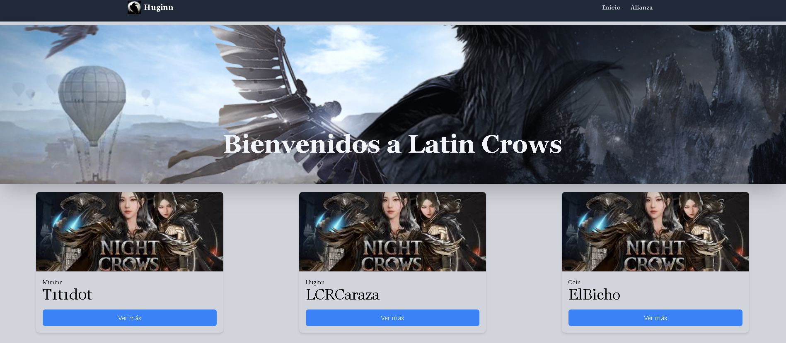

# React + Vite + tailwindcss + react router dom -> Landing page 

<figure></figure>

## Instructions

To run the project, follow these steps:

1. Clone the repository to your local machine using the following command:

```bash
git clone https://github.com/Aubar48/Huggins
```

2. Navigate to the project directory:

```bash
cd Huggins
```

3. Install the project dependencies with the following command:

```bash
npm install
```

4. Start the development server by running the following command:

```bash
"npm run dev"
```

### The server will stand up on port 5173. You can access the application in your web browser using the following URL: [http://localhost:5173/](http://localhost:5173)